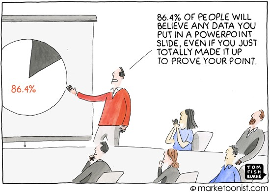

```{r setup, include=FALSE}
knitr::opts_chunk$set(echo=TRUE, message=FALSE, warning=FALSE)
```

<style>
.slide {height: 750px; overflow-y: auto !important;}  
.reveal section img { border:none;}
</style>


<!-- Communication Important -->
### Communication Is As Important As Everything Else


<!-- Data Viz -->
## Data Visualization Tools in R
1. ggplot2
2. R Shiny Applications
3. Plotly 
4. Leaflet  


<!-- ggplot2 -->
## ggplot
- Very popular plotting library in R 
- Based on <a href="https://www.springer.com/gp/book/9780387245447" target="_blank">The Grammar of Graphics</a>
  - The idea that every graph can be built from the same few components
- <a href="https://byrneslab.net/classes/biol607/readings/wickham_layered-grammar.pdf" 
  target="_blank">A Layered Grammar of Graphics</a>
  


<!-- Layered Grammar -->
## Components of the Layered Grammar
1. Data 
2. Aesthetic mapping
3. Geometric objects
4. Statistical transformation
5. Position adjustment 
6. Scale
7. Coordinate system
8. Facets

Data, aesthetic mappings, geometric objects, statistical transformations, and positional adjustment form layers.


<!-- ggplot -->
## ggplot 
Create a blank canvas
```{r}
library(ggplot2)

ggplot()
```


<!-- ggplot -->
## ggplot 
Can assign a variable to a ggplot object
```{r}
fig <- ggplot()
fig
```


<!-- Data -->
## <span style="font-size:30px"><span style="color:#5cb891;font-size:40px">Data</span> | Aesthetic Mapping | Geometric Objects | Statistical Transformation | Position Adjustment | Scale | Coordinate System | Facets</span>

```{r}
n <- 100
x <- runif(n, 0, 10)
residuals <- rnorm(n)
y <- x + residuals
df = data.frame(x=x, y=y)
```
Data must be in a data frame


<!-- Data -->
## <span style="font-size:30px"><span style="color:#5cb891;font-size:40px">Data</span> | Aesthetic Mapping | Geometric Objects | Statistical Transformation | Position Adjustment | Scale | Coordinate System | Facets</span>

```{r, eval=FALSE}
ggplot(df)
ggplot(data=df)
```
First argument is your data frame 


<!-- Aesthetic Mapping -->
## <span style="font-size:30px">Data | <span style="color:#5cb891;font-size:40px">Aesthetic Mapping</span> | Geometric Objects | Statistical Transformation | Position Adjustment | Scale | Coordinate System | Facets</span>

```{r}
ggplot(df, aes(x=x, y=y))
```


<!-- Geometric Objects -->
## <span style="font-size:30px">Data | Aesthetic Mapping | <span style="color:#5cb891;font-size:40px">Geometric Objects</span> | Statistical Transformation | Position Adjustment | Scale | Coordinate System | Facets</span>

```{r}
ggplot(df, aes(x=x, y=y)) +
  geom_point()
```


<!-- Aesthetic Mapping -->
## <span style="font-size:30px">Data | <span style="color:#5cb891;font-size:40px">Aesthetic Mapping</span> | Geometric Objects | Statistical Transformation | Position Adjustment | Scale | Coordinate System | Facets</span>

```{r}
size = sample(x=c(4, 3, 2, 1), size=nrow(df),
              prob=c(.1, .2, .3, .4), replace=T)
group = sample(x = c("a", "b", "c", "d"), size=nrow(df), 
               prob=c(.1, .2, .3, .4), replace=T)
df = cbind(df, size=size, color=group)

ggplot(df, aes(x=x, y=y, size=size, color=group)) + geom_point()
```


<!-- Geometric Objects -->
## <span style="font-size:30px">Data | Aesthetic Mapping | <span style="color:#5cb891;font-size:40px">Geometric Objects</span> | Statistical Transformation | Position Adjustment | Scale | Coordinate System | Facets</span>

```{r}
ggplot(df, aes(x=x, y=y)) +
  geom_point(size=.25, color="#00BFC4")
```


<!-- Aesthetic Mapping -->
## <span style="font-size:30px">Data | <span style="color:#5cb891;font-size:40px">Aesthetic Mapping</span> | Geometric Objects | Statistical Transformation | Position Adjustment | Scale | Coordinate System | Facets</span>

```{r, fig.show="hold", out.width="49%"}
ggplot(df, aes(x=x, y=y, color=group)) + 
  geom_smooth() + geom_point() 

ggplot(df, aes(x=x, y=y)) + 
  geom_smooth() + geom_point(aes(color=group))
```


<!-- Stat Trans -->
## <span style="font-size:30px">Data | Aesthetic Mapping | Geometric Objects | <span style="color:#5cb891;font-size:40px">Statistical Transformation</span> | Position Adjustment | Scale | Coordinate System | Facets</span>

```{r, fig.show="hold", out.width="49%"}
ggplot(df, aes(x=x, y=y)) + 
  geom_point() + geom_smooth()  

ggplot(df, aes(x=x, y=y)) + 
  geom_point() + geom_smooth(method=lm)  
```


<!-- Stat Trans -->
## <span style="font-size:30px">Data | Aesthetic Mapping | Geometric Objects | <span style="color:#5cb891;font-size:40px">Statistical Transformation</span> | Position Adjustment | Scale | Coordinate System | Facets</span>

```{r}
ggplot(df, aes(x=x)) +
  geom_histogram()
```


<!-- Stat Trans -->
## <span style="font-size:30px">Data | Aesthetic Mapping | Geometric Objects | <span style="color:#5cb891;font-size:40px">Statistical Transformation</span> | Position Adjustment | Scale | Coordinate System | Facets</span>

```{r, fig.show="hold", out.width="49%"}
ggplot(df) + geom_bar(aes(x=group))
ggplot(df) + geom_bar(aes(x=group, y=stat(prop), group=1))
```


<!-- Position -->
## <span style="font-size:30px">Data | Aesthetic Mapping | Geometric Objects | Statistical Transformation | <span style="color:#5cb891;font-size:40px">Positional Adjustment</span> | Scale | Coordinate System | Facets</span>

```{r, fig.show="hold", out.width="49%"}
ggplot(df) + geom_bar(aes(x=group, fill=factor(size)))
ggplot(df) + geom_bar(aes(x=group, fill=factor(size)), position="dodge")
```


<!-- Scale -->
## <span style="font-size:30px">Data | Aesthetic Mapping | Geometric Objects | Statistical Transformation | Positional Adjustment | <span style="color:#5cb891;font-size:40px">Scale</span> | Coordinate System | Facets</span>

```{r, fig.show="hold", out.width="49%"}
ggplot(df) + geom_bar(aes(x=group, y=stat(prop), group=1))

ggplot(df) +
  geom_bar(aes(x=group, y=stat(prop), group = 1)) +
  scale_y_continuous(labels=scales::percent)
```


<!-- Scale -->
## <span style="font-size:30px">Data | Aesthetic Mapping | Geometric Objects | Statistical Transformation | Positional Adjustment | <span style="color:#5cb891;font-size:40px">Scale</span> | Coordinate System | Facets</span>

```{r, fig.show="hold", out.width="49%"}
df$yExp <- exp(df$y)

ggplot(df, aes(x=x, y=yExp)) +
  geom_point()

ggplot(df, aes(x=x, y=yExp)) +
  geom_point() + scale_y_log10()
```


<!-- Coordinate -->
## <span style="font-size:30px">Data | Aesthetic Mapping | Geometric Objects | Statistical Transformation | Positional Adjustment | Scale | <span style="color:#5cb891;font-size:40px">Coordinate System</span> | Facets</span>
```{r, fig.show="hold", out.width="49%"}
ggplot(df, aes(x=x, y=y)) + geom_point() +
  coord_cartesian()

ggplot(df, aes(x=x, y=y)) + geom_point() +
  coord_cartesian(xlim = c(4, 6))
```


<!-- Coordinate -->
## <span style="font-size:30px">Data | Aesthetic Mapping | Geometric Objects | Statistical Transformation | Positional Adjustment | Scale | <span style="color:#5cb891;font-size:40px">Coordinate System</span> | Facets</span>

```{r, fig.show="hold", out.width="49%"}
library(mapproj)
 
ggplot() + 
geom_polygon(data=map_data("world"), aes(x=long, y=lat, group=group)) +  
  coord_map("orthographic", orientation=c(0, 0, 0))

ggplot() + 
geom_polygon(data=map_data("world"), aes(x=long, y=lat, group=group)) + 
  coord_map("mercator", xlim=c(-180,180))
```


<!-- Facets -->
## <span style="font-size:30px">Data | Aesthetic Mapping | Geometric Objects | Statistical Transformation | Positional Adjustment | Scale | Coordinate System | <span style="color:#5cb891;font-size:40px">Facets</span></span>


```{r}
ggplot(df, aes(x=x, y=y)) +
  geom_point() +
  facet_grid(~ size)

```


<!-- Layered Grammar -->
## Components of the Layered Grammar
1. Data 
2. Aesthetic mapping
3. Geometric objects
4. Statistical transformation
5. Position adjustment 
6. Scale
7. Coordinate system
8. Facets

Data, aesthetic mappings, geometric objects, statistical transformations, and positional adjustment form layers.


## Labels
```{r}
ggplot(df, aes(x=x, y=y, color=group)) + geom_point() +
  labs(title="Random Data",
       subtitle="Plotting some randomly generated data",
       x="The x-axis",
       y="The y-axis",
       color="The groups")
```


<!-- Data Viz -->
## Data Visualization
1. ggplot
2. R Shiny 
3. Plotly 
4. Leaflet 


## R Shiny
- R package that makes it easy to build interactive web apps using R code.
- Make interactive plots in R markdown or on a web page. 
- Build an online dashboard. 


## R Shiny

Three main components:

1. User Interface: Controls layout and appearance
2. Server: Instructions for building app
3. ShinyApp: Builds app with the user interface and server  


## R Shiny
```{r, eval=FALSE}
library(shiny)
ui <- fluidPage()
server <- function(input, output) {}
shinyApp(ui = ui, server = server)

```
This code must go into a file named app.R or into an R markdown cell.


## Let's Look At An Example


## R Shiny
What to do with shiny app?

- Can be embedded in R markdown

- Host it on a website
  - [https://www.shinyapps.io/](https://www.shinyapps.io/)


## Plotly 
- Another way to make interactive plots
- Wrappers written in several languages
  
  
  
## Plotly
```{r}
library(plotly)

p <- ggplot(df, aes(x=x, y=y)) + 
  geom_point()  
fig = ggplotly(p)
fig
```


## Plotly
```{r}
fig = plot_ly() %>%
  add_trace(data=df, x=~x, y=~y, mode="markers")
fig
```


## Plotly
```{r}
df[nrow(df),] = list(x=1,y=10)
fig = plot_ly() %>%
  add_trace(data=df, x=~x, y=~y, mode="markers", text=rownames(df))
fig
```


## Leaflet
```{r}
library(leaflet)

leaflet() %>%
  addTiles() %>%  
  addMarkers(lng=174.768, lat=-36.852, popup="The birthplace of R")
```


## Data Visualization
1. ggplot
2. R Shiny 
3. Plotly 
4. Leaflet 


